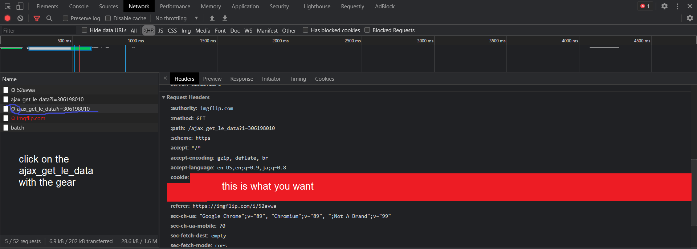
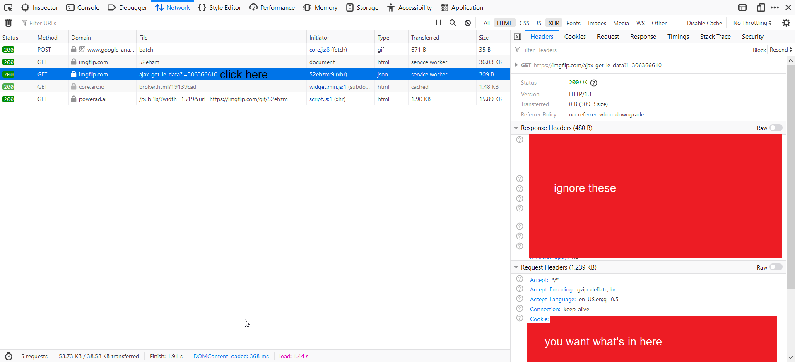

# IntellectualManBot
Bot from imgflip that used to comment on conservative posts

This requires **requests** and **BeautifulSoup4**.

**Note that this may violate the [ImgFlip Terms of Service](http://imgflip.com/terms) (see Using our Services), so use at your own risk.**

### What is everything?

* **allowed_streams.json** - A list of streams that the bot is allowed to comment in.
* **generic.json** - A list of responses that the bot always has a chance of sending.
* **im_blacklist.json** - A list of users whose memes the bot won't comment on.
* **tuned_responses.json** - A series of trigger words and their respective responses.

### What am I allowed to do with this code?

**You may:**

* Conduct social experiments
* Collect data about ImgFlip usage
* Demonstrate this code
* Modify this code
* Use this code for educational purposes

**You may NOT:**

* Spam comment sections
* Troll
* Intentionally stir controversy
* Make money off of this code or with this code
* Advertise anything in comment sections

**I am not responsible for the things you do with this code.**

### To get data for cookies.txt:

Log into your bot account, go to the imgflip homepage, right click anywhere on the page, and then click on "Inspect Element." Click on the Network tab, and then click on a meme without closing the developer tools.

For Chrome:

For Firefox:

Copy and paste the big string of cookies into your cookies.txt file, run IntellectualMan.py, and you should be good to go. 
